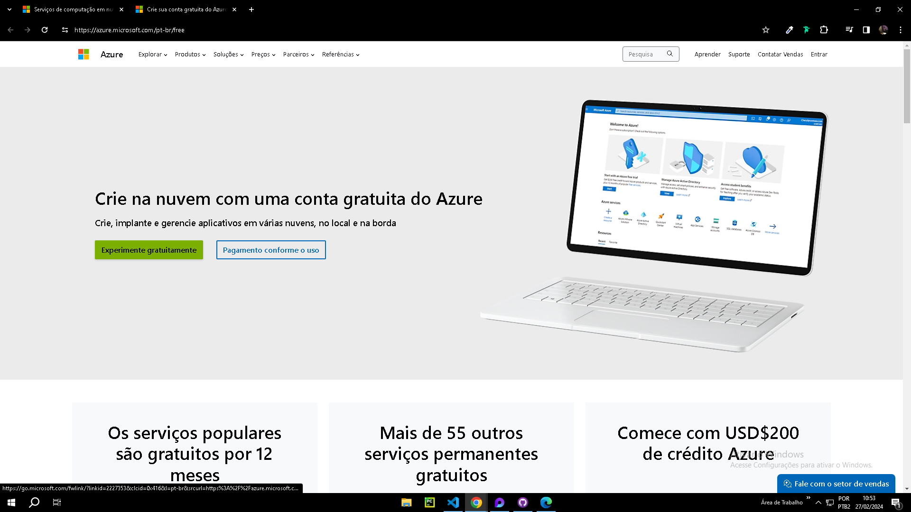
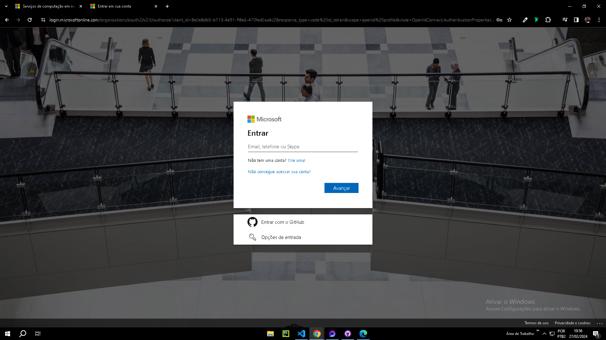
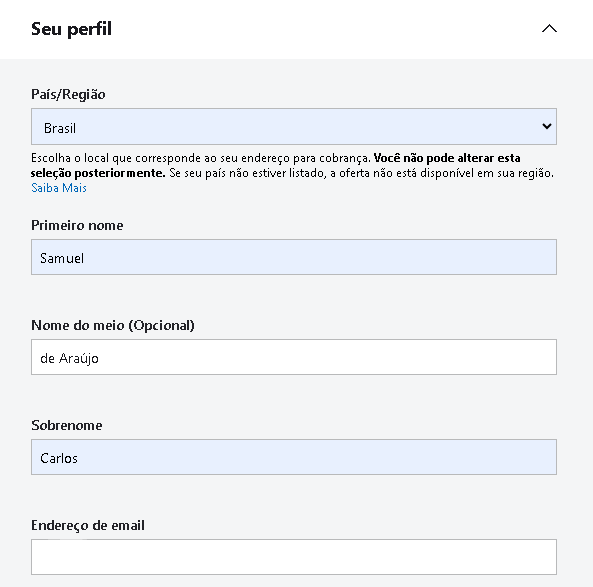
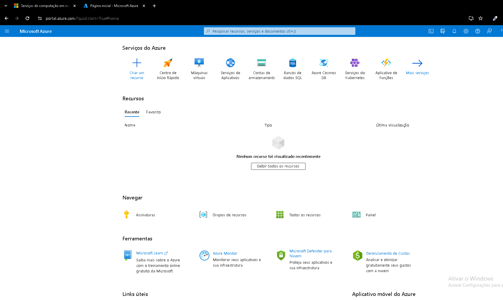

# Criando uma conta no Azure
para realizar todos os desafios propostos no curso será preciso a criação e login de sua conta na plataforma do azure

link para criar conta: <a href="https://azure.microsoft.com/pt-br/free"> Azure</a>

acesse o link e escolha criar experimente gratuitamente

 
 
 

após isso você deve logar com sua conta microsoft, caso não tenha terá de criar

 
 
 

 
cadastre seus dados como email, nome e endereço <strong style="color: chartreuse;">Recomendado habilitar autenticação em dois fatores</strong>

 
 
 

ele vai pedir um cartão e vai efetuar um pagamento de 2 dolares por ai, mas relaxe <strong style="color: chartreuse;">feito a cobrança eles retornam o valor</strong> isso é feito para ver se o cartão de fato funciona
 
 
 

informado os dados e o seu cartão, agora temos acesso a plataforma!